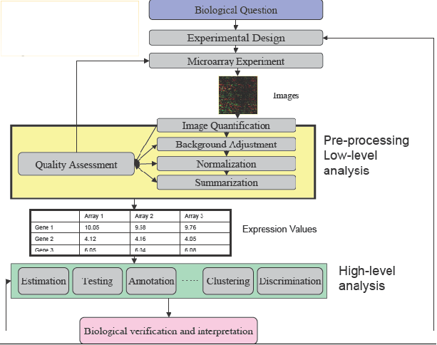

```{r class.source = 'fold-hide', setup, include=FALSE}
library(knitr)
library(rmdformats)

## Global options
options(max.print="75")
opts_chunk$set(echo=TRUE,
	             cache=FALSE,
               prompt=FALSE,
               tidy=TRUE,
               comment=NA,
               message=FALSE,
               warning=FALSE)
opts_knit$set(width=75)
```

# Introducción

Este documento presenta un análisis de datos de microarrays de principio a fin que es una propuesta de resolución de la PEC ("Prueba de Evaluación Continua") propuesta en la asignatura de "Análisis de Datos Ómicos" en la UOC.

Es importante insistir en la idea de "una propuesta". Es decir, muchos de los pasos del proceso de análisis de datos ómicos pueden hacerse de diversas formas, usando distintas aproximaciones o distintos paquetes. Incluso algunos pasos, como el filtraje o la exploración antes y después de normalizar, pueden omitirse sin que el resultado deba considerarse incorrecto. Es por ello que debemos insistir en que el objetivo del análisis es mostrar una forma razonablemente correcta de resolver el problema, siguiendo las indicaciones proporcionadas, y de acuerdo con los conceptos y métodos presentados en la asignatura.

## Estructura del documento

Habitualmente, un trabajo científico o técnico se organiza en varias partes: *Introducción*, *Material y Métodos*, *Resultados* y *Discusión*. Dado que el objetivo de este estudio es demostrar la aplicación de los métodos de análisis explicados en la asignatura esta estructura se relajará. Después de la introducción se realizará una breve descripción del proceso general y los métodos utilizados en cada paso. A continuación se presentarán los resultados obtenidos en cada fase del análisis. Finalmente se presentará una breve discusión sobre las posibles limitaciones encontradas.

Con el fin de facilitar la legibilidad del documento, se ha ocultado el código, con la opción global de Rmarkdown, `echo=FALSE`, para que, salvo que así se especifique, no se muestre en el texto. Aquellos fragmentos que se han querido mostrar se han modificado fragmento a fragmento con la opción `echo=TRUE`. El código del análisis se ha extraído del documento con la función `purl` del paquete `knitr` y se ha copiado en un "pedazo" de código final cuya ejecución se ha anulado, mediante la opción `eval=FALSE`.

## Contexto y Objetivos

Este trabajo puede enmarcarse en los estudios que se han llevado a cabo a raíz de la reciente pandemia por infecciones con SARS-COV-2. Entre la multitud de estudios realizados, uno de los objetivos principales ha sido, es, comprender los mecanismos biológicos de la respuesta a la infección por SARS-COV-2. 

En esta PEC analizaremos los datos de un estudio reciente [@Masood2021] llevado a cabo con una cohorte de pacientes en Pakistan y cuyos datos han sido depositados en el repositorio "Gene Expression Omnibus", con 
identificador GSE177477.

Para este estudio, los investigadores trabajaron con muestras de sangre de humanos que clasificaron en tres grupos: SANOS, sin la enfermedad, ASINTOMÁTICOS, enfermos sin síntomas, SINTOMÁTICOS, enfermos con síntomas.

El objetivo del análisis que se plantea en la PEC es encontrar genes diferencialmente expresados entre los tres grupos y, a partir de éstos realizar un análisis de significación biológica que, de alguna forma, sirva para interpretar las diferencias observadas.

El estudio original se realizó con 47 muestras. Para la PEC deberéis trabajar con un subconjunto de 15 muestras para lo que debéis escoger aleatoriamente cinco muestras de cada grupo y formar con ellas vuestros "targets". _Por un error, el enunciado de la PEC indicaba "cuatro" de cada grupo. Ambas soluciones (15 = 3x5 y 12 =3x4) se considerarán correctas_.

El objetivo de este análisis -que no coincide necesariamente con el del estudio original- es, pues, encontrar genes diferencialmente expresados y  pathways que caracterizen dicha diferencia. Concretamente, se buscaran diferencias entre estos grupos:

1. Sanos y Asintomáticos
2. Asintomáticos y Sintomáticos
3. Sanos y Sintomáticos

# Materiales y métodos

## Etapas del analisis

El análisis se ha realizado siguiendo las pautas descritas en los materiales de la asignatura <https://aspteaching.github.io/Analisis_de_datos_omicos-Materiales_para_un_curso/> y resumidos en la figura 1.

```{r, fig.align='center'}

```

## Métodos de análisis

*Esta primera parte es ficticia en tanto que no hemos tenido acceso al proceso de elaboración de los microarrays, por lo que he escrito lo que suele ponerse en esta parte*

Antes de hibridar los microarrays se comprobó la calidad del RNA de cada muestra. Sólo las que demostraron una calidad suficiente -presumiblemente un valor de "Bio-analyser" igual o superior a 7- se sometieron a análisis posterior.

Los valores "crudos" de expresión obtenidos directamente de los archivos CEL se pre-procesaron utilizando el método de RMA [@rmaIri], un proceso de tres pasos que integra la corrección de fondo, la normalización y el resumen de los valores del grupo de sondas en un único valor de expresión *absoluta*. Dichos valores normalizados fueron la base para todos los análisis.

Antes de la selección de genes los valores normalizados se sometieron a un filtraje no específico para eliminar los genes de baja señal (los genes cuya media de la señal en cada grupo no supera un umbral mínimo) y los genes de baja variabilidad (los genes cuyo rango intercuartil entre todas las muestras no superó un umbral mínimo).

La selección de genes diferencialmente expresados entre condiciones experimentales se baso en la utilización de modelos lineales complementados con una moderación de la varianza mediante métodos bayesianos empíricos siguiendo la metodología desarrollada por Smythe (@Smyth2004). Este método extiende el análisis de la varianza clásico utilizando métodos Bayesianos empíricos para combinar la información de cada gen individual con la de todos los genes restantes para obtener mejores estimaciones de error. Esto es de gran utilidad en análisis de microarrays, un contexto en el que el tamaño de las muestras es a menudo pequeño lo que puede dar lugar a estimaciones de los errores erráticos y, en consecuencia, p-valores que no son de fiar.

Los genes más relevantes de cada comparación se resaltaron utilizando *volcano-plots*, que organizan los genes a lo largo de dos dimensiones que podemos considerar de importancia biológica y estadística. El eje horizontal representa el cambio medio de expresión entre los dos grupos (en una escala logarítmica, por lo que la regulación hacia arriba y abajo aparecen simétrica), y el segundo (vertical) representa el *menos logaritmo del p-valor* por lo que los genes cuyo p-valor asociado sea inferior aparecen más arriba. El primer eje indica el impacto biológico del cambio, y el segundo indica la evidencia estadística, o la fiabilidad de dicho cambio.

Con el fin de hacer frente a la problemática derivada del hecho de que muchas pruebas (una por cada gen) se realizan simultáneamente, se realizo un ajuste de p--valores para obtener control sobre la tasa de falsos positivos usando el método de Benjamini y Hochberg [@Benjamini1995].

Los genes seleccionados como diferencialmente expresados se agruparon para buscar patrones comunes de expresión entre condiciones experimentales. Para ello se utilizaron mapas de colores o *Heatmaps* que realizan una agrupación jerárquica de los genes y/o las muestras y la representan mediante una gama de colores apropiada, de forma que valores altos o bajos se corresponden a colores distintos de la gama escogida.

Las listas de genes diferencialmente expresados se anotaron en diversas bases de datos ("Entrez", "Unigene", "Gene Ontology", "KEGG", ...) utilizando los paquetes de anotación para microarrays de Affymetrix disponibles en el proyecto Bioconductor <http://bioconductor.org>.

Para contribuir a la interpretación biológica de los resultados se realizó un análisis de enriquecimiento (@Falcon:2007) que busca establecer si las categorías funcionales de los genes seleccionados aparecen entre estos genes con mayor (o menor) frecuencia que entre todos los del genoma. De ser así se indica que la lista de genes se encuentra "enriquecida" en estas funcionalidades, o lo que es lo mismo que los procesos afectados por las diferencias son éstos.

### Herramientas y procedimientos bioinformáticos de análisis

Los análisis estadísticos se realizaron utilizando el lenguaje estadístico R y las librerías desarrolladas para el análisis de microarray en el proyecto de Bioconductor.

El código siguiente se utilizó para instalar los paquetes de Bioconductor necesarios para el análisis.

```{r, librerias, echo=TRUE}
installifnot <- function (pckgName){
if(!(require(pckgName, character.only=TRUE))){
  BiocManager::install(pckgName)
  }
}
installifnot("Biobase")
installifnot("oligo")
installifnot("pd.clariom.s.human")
installifnot("clariomshumantranscriptcluster.db")
installifnot("arrayQualityMetrics")
installifnot("genefilter")
installifnot("limma")
installifnot("annotate")
installifnot("hwriter")
installifnot("gplots")
installifnot("GOstats")
# installifnot("clusterprofiler")
```

# Obtención y lectura de los datos

## Los datos para el análisis

Este estudio tiene 47 muestras en tres grupos pero lo que trabajaremos con un subconjunto de las mismas (esto es más por finalidad académica que por necesidad de reducir el coste computacional)

Los datos crudos pueden descargarse de GEO directamente accediendo a la dirección: <https://www.ncbi.nlm.nih.gov/geo/query/acc.cgi?acc=GSE177477> donde encontramos el enlace para la descarga, al final de la página:

Descargamos los archivos comprimidos a un directorio "datos" que crearemos como subdirectorio de nuestro proyecto. Allí descomprimiremos dichos archivos hasta tener los archivos .CEL

## La "plataforma" o tipo de microarray

Para trabajar con microarrays, necesitamos conocer de que tipo son, puesto que ello nos permite saber qué paquete de anotaciones necesitamos Esta información se encuentra también en la página de GEO correspondiente a los datos:

En concreto se indica que se trata de arrays del tipo "CLARIOM-S" de la compañía Termo Fisher (antes Affymetrix). Un poco de investigación nos lleva a la conclusión que las anotaciones que necesitaremos se encuentran en el paquete `clariomshumantranscriptcluster.db` de Bioconductor.

Es importante no confundir los paquetes de anotaciones con los paquetes de diseño de plataforma, cuyo nombre empieza con "pd", como `pd.clariom.s.human` y que sirven para que, al leer los datos crudos pueda asociarse cada posición con cada sonda.


## Selección de muestras y carga de los datos

La lectura de datos se lleva a cabo utilizando las clases y métodos definidas en los paquetes `Biobase` y `oligo` de Bioconductor. Una forma cómoda de leer los datos y, al mismo tiempo, asignar a cada muestra los valores de las covariables (por ejemplo el grupo para el análisis) consiste en crear un pequeño archivo de texto, que suele denominarse `targets` y que contiene la identificación de cada archivo con la asignación de cada muestra a cada condición experimental. 

El código siguiente muestra como crear un archivo `targetsAll.csv` con los nombres de los archivos, y algunos campos adicionales, como el "shortName", una etiqueta corta para la visualización "grupo" para la definición de grupos o "colores" con el nombre del color para las visualizaciones. Obviamente, ésta no es más que **una de las posibles formas de hacerlo**.

Supondremos que hemos descomprimido el archivo .tar y hemos copiado los archivos .CEL a un directorio de nuestro directorio de trabajo denominado "datos". 

También asumimos que sabemos, (porque lo pone en la página de GEO, [https://www.ncbi.nlm.nih.gov/geo/query/acc.cgi?acc=GSE177477](https://www.ncbi.nlm.nih.gov/geo/query/acc.cgi?acc=GSE177477)) que:
- Las muestras S1 a S11 son "Sintomáticas".
- Las muestras S12 a S29 son "Asintomáticas
- Las muestras S30 a S47 son "Controles_Sanos"
Esta información se introduce en el archivo "targets".

```{r class.source = 'fold-hide'}
listaArchivos <- list.files("datos", pattern="*.CEL")
print(listaArchivos)
archivosCel <- listaArchivos[1:47]
cols <- c(rep("red", 11), rep("green", 18), rep("blue", 18))
grup <- c(rep("SINT", 11), rep("ASINT", 18), rep("SANO",18))
shortNames <-paste(c(substr(archivosCel[1:9],12,13), substr(archivosCel[10:47],12,14)), grup, sep=".")

targets <- data.frame(fileNames = archivosCel, 
                      shortName = shortNames, 
                      grupo = grup,
                      colores = cols, row.names=shortNames)
write.csv(targets, "targetsAll.csv")
```

El contenido del archivo `targets` se utiliza en la lectura de los datos y la creación del objeto `rawData` las intensidades "crudas" de cada archivo .CEL.

### Creación de un subconjunto para el análisis

Con el fin de que nuestro análisis contenga un número moderado de muestras podemos extraer aleatoriamente 5 muestras de cada grupo. Para ello utilizaremos la función `selectSample`para crear un nuevo objeto "targets" que tenga únicamente las filas seleccionadas.

```{r class.source = 'fold-hide', echo=TRUE}
selectSamples<- function (myID){
  set.seed(myID)
  selected <- c(sample(1:11, 5),
                sample(12:29, 5), 
                sample(30:47, 5))
  return(sort(selected))
}
```

Escogiendo como argumento el número "1234567" se obtiene:

```{r eval=FALSE}
mySelected <- selectSamples(1234567)
selectedTargets <- targets[mySelected,]
rownames(selectedTargets) <- selectedTargets$shortName
table(selectedTargets$grupo)
```

### Trabajamos con **todos** los datos

El muestreo anterior es lo que debéis hacer para resolver la PEC, para lo cual, simplemente, utilizaríais el objeto `selectedTargets` para indicar que archivos debe cargar. Dado que todas las soluciones serán distinta, en ésta trabajaremos con **todas** las muestras, lo que, hay que reconocerlo, nos aportará algo más de información.

Para ello, simplemente, revertimos el proceso y denominamos:

```{r}
selectedTargets <- targets
```

Si no hicierais el paso anterior trabajaríais únicamente con las 15 muestras seleccionadas.


## Lectura de los datos

En primer lugar crearemos un objeto de tipo `annotatedDataFrame` que utilizaremos para leer los datos crudos.

```{r, phenoData1}
require(Biobase)
sampleInfo <-AnnotatedDataFrame(selectedTargets) 
show(pData(sampleInfo))
```

La lectura de los datos se realiza con la función Dado que se trata de arrays algo antiguos, del tipo de los que aparecen en los materiales docentes podemos utilizar el paquete `affy` para leer los datos.

```{r}
library(oligo)
CELfiles <- selectedTargets$fileNames
rawData <- read.celfiles(file.path("datos", CELfiles),
                         phenoData = sampleInfo)
colnames(exprs(rawData)) <- rownames(pData(rawData))
show(rawData)
```

Este objeto es la base para todos los análisis que se realizarán a continuación.

# Preprocesado: Exploración, Control de Calidad y Normalización

## Exploración y visualización

La exploración de los datos suele basarse en técnicas univariantes como los histogramas o los diagramas de caja o en técnicas multivariantes como los análisis de conglomerados (clusters), de distancias o de análisis de componentes principales.

```{r, etiquetas}
colores <- pData(rawData)$colores
grupos <- as.factor(pData(rawData)$grupo)
numSamples <- nrow(pData(rawData))
sampleLabels <-pData(rawData)$shortName
```

```{r, explora1}
hist(rawData, main="Distribución de valores", col=colores, lty=1:numSamples)
legend (x="topright", legend=sampleLabels , col=colores, lty=1:numSamples, cex=0.5)

## ----boxplot
boxplot(rawData, cex.axis=0.6, col=colores, las=2, names=sampleLabels, main="Distribución de la señal")
```

El histograma y el diagrama de caja sugieren que hay dos tipos de muestras de cada tipo lo que podría atribuirse a un efecto batch.

**Obviamente esto no es sencillo de intuir con cinco muestras por lo que, si no lo habéis detectado o gestionado no pasa nada!!!**


```{r, plotPCA}
library(ggplot2)
library(ggrepel)
plotPCA3 <- function (datos, labels, factor, title, scale,colores, size = 1.5, glineas = 0.25) {
  data <- prcomp(t(datos),scale=scale)
  # plot adjustments
  dataDf <- data.frame(data$x)
  Group <- factor
  loads <- round(data$sdev^2/sum(data$sdev^2)*100,1)
  # main plot
  p1 <- ggplot(dataDf,aes(x=PC1, y=PC2)) +
    theme_classic() +
    geom_hline(yintercept = 0, color = "gray70") +
    geom_vline(xintercept = 0, color = "gray70") +
    geom_point(aes(color = Group), alpha = 0.55, size = 3) +
    coord_cartesian(xlim = c(min(data$x[,1])-5,max(data$x[,1])+5)) +
    scale_fill_discrete(name = "Group")
  # avoiding labels superposition
  p1 + geom_text_repel(aes(y = PC2 + 0.25, label = labels),segment.size = 0.25, size = size) + 
    labs(x = c(paste("PC1",loads[1],"%")),y=c(paste("PC2",loads[2],"%"))) +  
    ggtitle(title)+ 
    theme(plot.title = element_text(hjust = 0.5)) +
    scale_color_manual(values=colores)
  }
```

```{r, explora2}
plotPCA3(exprs(rawData), labels=sampleLabels, size=2, 
         factor =grupos, colores = unique(colores), title="PCA de las muestras", scale=TRUE)
# dev.off()
```

La representación de los datos refuerza la impresión que hay dos tipos de muestras, aparte de un posible "outlier", la muestra S24.ASINT

La primera componente parece separar los dos posibles lotes, puesto que deja a la derecha un grupo de muestras menos variables, y a la izquierda otro grupo de todos los subtipos.

Un cluster jerárquico refuerza esta impresión de que existen dos posibles grupos de muestras.

```{r, explora3}
clust.euclid.average <- hclust(dist(t(exprs(rawData))),method="average")
plot(clust.euclid.average, labels=sampleLabels, main="Hierarchical clustering of samples",  hang=-1, cex=0.6)
```

## Control de calidad

El paquete `arrayQualitMetrics` encapsula todos los análisis anteriores, y alguno más, facilitando su ejecución e incluso su interpretación. La instrucción `arrayQualityMetrics` lleva a cabo todos los análisis de una vez y genera un informe de resultados con ayudas a la interpretación y a la detección de arrays problemáticos.

```{r, arrayQM, cache=TRUE, eval=FALSE}
library(arrayQualityMetrics)
arrayQualityMetrics(rawData, outdir = "arrayQuality",intgroup= "grupo", force=TRUE)
```

Los resultados del control de calidad realizado con `arrayQualityMetrics` se encuentran accesibles a través del archivo index.html contenido en el subdirectorio creado al invocarlo -en este caso denominado `arrayQuality`.

## Análisis de posibles efectos batch

Los análisis de componentes principales sugieren que puede haber algún factor que se superponga a las diferencias entre los grupos. 

Una posibilidad es decidir que, puesto que ésto es así a todas luces (hay dos tipos de muestras) se atribuye el batch arbitrariamente.

Otra posibilidad es consultar la información sobre covariables disponible en GEO usando el paquete `GEOquery`. Esta opción que se presenta "no evaluada" tampoco resulta de utilidad porque las únicas covariables que este archivo contiene son la enfermedad (SANO/ENFERMO) o los Síntomas (SANO/ASNITOMATICO/SINTOMATICO).

```{r, eval=FALSE}
library(GEOquery)
GEOdata <- getGEO("GSE177477")
library(Biobase)
class(GEOdata)
class(GEOdata[[1]])
eset<- GEOdata[[1]]
GEOtargets <- pData(eset)
save(GEOtargets, file="GEOtargets.Rda")
apply(GEOtargets, 2, function(s) length(unique(s)))
table(GEOtargets$"symptons:ch1")
table(GEOtargets$"disease state:ch1")
```


Dado que no se dispone de información sobre otras covariables es difícil decidir si ésto es así. Una causa habitual del efectos batch es la fecha en que se procesan las muestras.

La función `runDate` del paquete `oligo` proporciona la fecha de hibridación de los archivos .CEL

```{r}
require(oligo)
dias <- substr(runDate(rawData), 1, 10)
table(dias)
table(dias, targets$grupo)
```

Como puede verse todos los arrays se hibridaron en períodos de tiempo distintos:
- Todos los sanos en 2019
- Todos los sintomáticos en 2020
- Los asintomáticos en 2020 y 2021

Curiosamente los dos grupos que aparentemente aparecen en el diagrama de cajas no se relacionan con los síntomas pero en vista de que no se dispone de información sobre qué causa la diferencia y que además hay un desbalanceo entre tipo de muestras por síntomas y años, asumiremos que este efecto puede afectar los resultados pero no intentaremos corregirlo


## Normalizacion y Filtraje

Una vez realizado el control de calidad se procede a normalizar los datos y agregarlos.

```{r class.source = 'fold-hide', normalizacion}
eset_rma <- rma(rawData)    
eset_rma
```

Si repetimos el PCA y la visualización observamos que los grupos quedan aún más mezclados, lo que es un efecto conocido de la normalización RMA.

```{r, exploraNorm}
plotPCA3(exprs(eset_rma), labels=sampleLabels, size=2, factor =grupos, colores = unique(colores), title="selected samples", scale=TRUE)
```

Interesantemente, una vez normalizados los datos, ha bajado el % de variabilidad explicada pero la diferencia entre individuos sintomáticos y los que no lo son se muestra claramente, lo que sugiere que, globalmente, esta diferencia es superior a la atribuible a posibles efectos batch.

## Filtraje

El filtraje no específico permite eliminar los genes que varían poco entre condiciones o que deseamos quitar por otras razones como por ejemplo que no disponemos de anotación para ellos. La función `nsFilter` permite eliminar los genes que, o bien varían poco, o bien no se dispone de anotación para ellos. Si al filtrar deseamos usar las anotaciones, o la falta de ellas, como criterio de filtraje debemos disponer del correspondiente paquete de anotaciones.

Si al crear el objeto `expressionSet` no se le ha asignado una anotación debe hacerse antes de filtrar pera evitar un error, que se producirá en el caso que intentemos filtrar con el parámetro `require.entrez`puesto en TRUE.

El procedimiento de lectura identifica el tipo de array y rellena automáticamente el campo `annotation`. Podemos visualizarlo con la instrucción `annotation`.

```{r, echo=TRUE}
show(annotation(eset_rma))
```

__Aquí hay que proceder con cuidado__ En arrays de tipo 3'ITV esta información sería la que utilizaríamos, pero el paquete `oligo`utiliza dos paquetes de anotaciones:

- Los paquetes pd.XXX
- los paquetes XXXtranscriptcluster.db

Para la anotación necesitamos el segundo, por lo que debemos modificar el contenido del campo "annotation"

```{r}
annotation(eset_rma) <-"clariomshumantranscriptcluster.db" 
```

Aplicaremos un filtraje "estándar" que retenga el 50% de los genes con mayor variabilidad de entre aquellos que están correctamente anotados, es decir eliminando aquellos que no tienen identificador en la base de datos `Entrez`.

```{r class.source = 'fold-hide', filtraje}
library(genefilter)
filtered <- nsFilter(eset_rma, require.entrez=TRUE,
         remove.dupEntrez=TRUE, var.func=IQR,
         var.cutoff=0.5, var.filter=TRUE,
         filterByQuantile=TRUE, feature.exclude="^AFFX")
```

El resultado del filtraje es una lista con varios objetos, que informan de lo que se ha descartado y un objeto `expressionSet` que, en lugar de 29129 "features" tiene 10039 que son los que están anotados y tienen mayor variabilidad. La selección de genes se llevará a cabo sobre esta lista.

```{r, echo=TRUE}
names(filtered)
class(filtered$eset)
print(filtered$filter.log)
eset_filtered <-filtered$eset
eset_filtered 
```

A partir de ahora trabajaremos con los datos filtrados, porque ésto simplificará entre otras cosas la anotación de resultados.


## Anotación de los datos

Los datos de expresión normalizados se identifican por el nombre de la muestra, que además identifica el grupo, y por el identificador del gen.

```{r}
head(exprs(eset_filtered)[1:10, c(1,2,15,16,30,31)])
```

Como puede verse, los identificadores de muestras son explicativos pero no así los nombres de los genes.

Para convertir los identificadores de la compañía (Thermo Fisher)  en identificadores estándar usaremos el paquete de anotaciones `clariomshumantranscriptcluster.db`.

```{r}
probeIds <- rownames(exprs(eset_filtered))
columns(clariomshumantranscriptcluster.db)
geneIds <- AnnotationDbi::select(clariomshumantranscriptcluster.db, 
                  keys=probeIds, 
                  columns = c("ENTREZID", "SYMBOL"))
head(geneIds)
```


### Archivos de resultados normalizados

Los dos objetos `expressionSet` resultantes de la normalización y el filtraje se almacenan en un archivo binario `datos.normalizados.Rda`, que será la base para todos los estudios posteriores.

```{r class.source = 'fold-hide', saveData}
save(eset_rma, eset_filtered, geneIds, file="datos.normalizados.Rda")
```

# Selección de genes diferencialmente expresados

Como en las etapas anteriores la selección de genes diferencialmente expresados (GDE) puede basarse en distintas aproximaciones, desde la t de Student al programa SAM pasando por multitud de variantes. 

En este ejemplo, dado que se realizaran tres comparaciones que luego deseamos comparar entre ellas, se aplicará la aproximación presentada por @Smyth2004 basado en la utilización del modelo lineal general combinada con un método para obtener una estimación mejorada de la varianza.

## Matrices de diseño y de contrastes

El primer paso para el análisis basado en modelos lineales es crear la matriz de diseño.

Básicamente, la matriz de diseño es una tabla que describe la asignación de cada muestra a un grupo. Tiene tantas filas como muestras y tantas columnas como grupos (si solo se considera un factor). Cada fila contiene un uno en la columna del grupo al que pertenece la muestra y un cero en las restantes.

La matriz de contrastes se utiliza para describir las comparaciones entre grupos. Consta de tantas columnas como comparaciones y tantas filas como grupos (es decir como columnas de la matriz de diseño). Una comparación entre grupos --llamada "contraste"-- se representa con un "1" y un "-1" en las filas de los grupos a comparar y ceros en las restantes. Si varios grupos intervinieran en la comparación se tendría tantos coeficientes como grupos con la única restricción de que su suma sería cero.

La matriz de diseño puede definirse manualmente o a partir de un factor creado específicamente para ello. Utilizaremos el segundo método basándonos en el campo "grupo"

```{r class.source = 'fold-hide', matDesign1b}
fgrupos <- factor(grupos, levels=c("SINT", "ASINT", "SANO"))
design <- model.matrix(~ 0+fgrupos)
rownames(design) <-  sampleLabels 
colnames(design) <- c("SINT", "ASINT", "SANO")
print(design)
```

Las comparaciones que nos interesan son:

1. Diferencia entre asintomáticos y sanos

- ASINT - SANO

2.  Diferencia entre sintomáticos y asintomáticos

- SINT - ASINT

3.  Diferencia entre SINTOMATICOS Y SANOS

- SINT - SANO

Estas tres comparaciones se pueden agrupar en una _matriz de contrastes_.

```{r class.source = 'fold-hide', contrastes, echo=TRUE}
library(limma)
cont.matrix <- makeContrasts (
      AsintVSSano = ASINT - SANO, 
      SintVSAsint = SINT - ASINT,
      SintVSSano = SINT - SANO,
      levels=design)
print(cont.matrix)
```

## Estimación del modelo y selección de genes

Una vez definida la matriz de diseño y los contrastes podemos pasar a estimar el modelo, estimar los contrastes y realizar las pruebas de significación que nos indiquen, para cada gen y cada comparación, si puede considerarse diferencialmente expresado.

El método implementado en limma amplía el análisis tradicional utilizando modelos de Bayes empíricos para combinar la información de toda la matriz de datos y de cada gen individual y obtener estimaciones de error mejoradas.

El análisis proporciona los estadísticos de test habituales como Fold-change t-moderados o p-valores ajustados que se utilizan para ordenar los genes de más a menos diferencialmente expresados.

A fin de controlar el porcentaje de falsos positivos que puedan resultar del alto numero de contrastes realizados simultáneamente los p--valores se ajustan de forma que tengamos control sobre la tasa de falsos positivos utilizando el método de Benjamini y Hochberg.

```{r class.source = 'fold-hide', linearmodelfit}
library(limma)
fit<-lmFit(eset_filtered, design)
fit.main<-contrasts.fit(fit, cont.matrix)
fit.main<-eBayes(fit.main)
```

La función `topTable` genera para cada contraste una lista de genes ordenados de mas a menos diferencialmente expresados.

```{r class.source = 'fold-hide', topTabs1}
topTab_AsintVSSano <- topTable (fit.main, number=nrow(fit.main), coef="AsintVSSano", adjust="fdr"); head(topTab_AsintVSSano)
topTab_SintVSAsint <- topTable (fit.main, number=nrow(fit.main), coef="SintVSAsint", adjust="fdr"); head(topTab_SintVSAsint)
topTab_SintVSSano  <- topTable (fit.main, number=nrow(fit.main) , coef="SintVSSano", adjust="fdr"); head(topTab_SintVSSano)
```

Para identificar los genes más diferencialmente expresados podemos utilizar la lista de anotaciones y añadir algunas a las `topTables`.

```{r}
library(magrittr)
anotaTopTab <- function(topTab){
  topTab_Anot  <- topTab %>% 
    dplyr::mutate (PROBEID=rownames(topTab)) %>%
    merge(geneIds, "PROBEID") %>% 
    dplyr::arrange(adj.P.Val)
  return(topTab_Anot)
}
topTab_AsintVSSano_Anot <- anotaTopTab (topTab_AsintVSSano)
topTab_SintVSAsint_Anot <- anotaTopTab (topTab_SintVSAsint)
topTab_SintVSSano_Anot <- anotaTopTab (topTab_SintVSSano)
```


## Comparaciones múltiples

Cuando se realizan varias comparaciones a la vez puede resultar importante ver que genes cambian simultáneamente en más de una comparación.

Si el número de comparaciones es alto también puede ser necesario realizar un ajuste de p-valores entre las comparaciones, distinto del realizado entre genes.

La función `decidetests` permite realizar ambas cosas. En este ejemplo no se ajustaran los p-valores entre comparaciones. Tan solo se seleccionaran los genes que cambian en una o más condiciones.

EL resultado del análisis es una tabla `res` que para cada gen y cada comparación contiene un 1 (si el gen esta sobre-expresado o `up'' en esta condicion), un 0 (si no hay cambio significativo) o un -1  (si esta`down''-regulado).

```{r class.source = 'fold-hide', decideTests}
res<-decideTests(fit.main, method="separate", adjust.method="fdr", p.value=0.05, lfc=0)
```

Para resumir dicho análisis podemos contar qué filas tienen como mínimo una celda distinta de cero:

```{r class.source = 'fold-hide', resumeDecideTests, eval=TRUE}
sum.res.rows<-apply(abs(res),1,sum)
res.selected<-res[sum.res.rows!=0,] 
print(summary(res))
```

Un diagrama de Venn permite visualizar la tabla anterior sin diferenciar entre genes `up'' o`down'' regulados.

```{r class.source = 'fold-hide',   fig.cap="Número de genes seleccionado en cada comparacion"}
vennDiagram (res.selected[,1:3], main="Genes in common #1", cex=0.9)
```

Si ahora visualizamos los resultados de cada comparación por separado, podemos observar como los volcano-plots concuerdan con la tabla anterior

```{r}
xlimits <- c(-3,+3)
maxY <- -log(topTab_AsintVSSano_Anot$adj.P.Val[1])
ylimits <- c(0,maxY)
genenames<- topTab_AsintVSSano_Anot$SYMBOL
coef <- 1
volcanoplot(fit.main, highlight=10,
            names=genenames, coef=coef, 
           main = paste("DEGS en comparación ",
                    colnames(cont.matrix)[coef],
                    sep="\n"),cex.main=0.8,
            xlim=xlimits, ylim=ylimits)
            
abline(v = c(-1, 1))

xlimits <- c(-5,+5)
ylimits <- c(0,40)
genenames<- topTab_SintVSAsint_Anot$SYMBOL
coef <- 2
volcanoplot(fit.main, highlight=10,
            names=genenames, coef=coef, 
            main = paste("DEGS en comparación ",
                    colnames(cont.matrix)[coef],
                    sep="\n"),cex.main=0.8,
            xlim=xlimits, ylim=ylimits)
abline(v = c(-1, 1))

xlimits <- c(-5,+5)
ylimits <- c(0,40)
genenames<- topTab_SintVSSano_Anot$SYMBOL
coef <- 3
volcanoplot(fit.main, highlight=10,
            names=genenames, coef=coef, 
            main = paste("DEGS en comparación ",
                    colnames(cont.matrix)[coef],
                         sep="\n"),cex.main=0.8,
            xlim=xlimits, ylim=ylimits)
abline(v = c(-1, 1))
```


## Visualización de los perfiles de expresión

Tras seleccionar los genes diferencialmente expresados podemos visualizar las expresiones de cada gen agrupándolas para destacar los genes que se encuentran up o down regulados simultáneamente constituyendo *perfiles de expresión*.

Hay distintas formas de visualización pero aquí tan sólo se presenta el uso de mapas de color o "Heatmaps".

En primer lugar seleccionamos los genes a visualizar: Se toman todos aquellos que han resultado diferencialmente expresados en alguna de las tres comparaciones.

```{r class.source = 'fold-hide', prepareData}
probeNames<-rownames(res)
probeNames.selected<-probeNames[sum.res.rows!=0]
exprs2cluster <-exprs(eset_filtered)[probeNames.selected,]
symbols<- AnnotationDbi::select(clariomshumantranscriptcluster.db, probeNames.selected, columns="SYMBOL")[,2]
colnames(exprs2cluster)<-sampleLabels
rownames(exprs2cluster)<- symbols
color.map <- function(grupo) { 
  if (grupo=="SINT"){
    c<- "red" 
  }else{ 
    if (grupo=="ASINT"){
      c<- "green"
    }else{
     if (grupo=="SANO"){
      c<- "blue"
     }else{
       c<- "green"
     }
    }
   }
return(c)
}
```

Para representar el Heatmap tan sólo necesitamos la matriz de datos resultante.

```{r class.source = 'fold-hide', plotHeatMap1, fig.cap="Mapa de colores basado en los genes seleccionados por estar diferencialmente expresados."}

grupColors <- unlist(lapply(pData(eset_filtered)$grupo, color.map))
heatmap(exprs2cluster, col=rainbow(100), ColSideColors=grupColors, cexCol=0.9)
```


# Análisis de significación biológica

## Métodos de análisis

Una vez obtenidas las listas de genes diferencialmente expresados pueden llevarse a cabo todo tipo de análisis sobre ellas, generalmente encaminados a facilitar la interpretación de los resultados.

EL análisis de significación biológica de las listas mediante análisis de enriquecimiento ("Over-Representation Analysis") permite detectar si las listas de genes diferencialmente expresadas presentan una cantidad, superior a la esperada ("se encuentran enriquecidas"), de genes asociados a funciones o procesos biológicos determinados, es decir anotados en categorías biológicamente relevantes para el problema que se estudia.

Alternativamente el "Gene Set Expresion Analysis" permitiría determinar conjuntos de genes que se encuentren asociados a las diferencias que se estudian. 

En este caso, y dado que el análisis de la interacción muestra  pocos o ningún gen seleccionado tan sólo se realizará un análisis de enriquecimiento para las dos comparaciones  simples.

Se han desarrollad multitud de variantes de estos tipos de análisis (@Khatri:2005) pero aquí utilizaremos el análisis básico de enriquecimiento tal como se implementa en el paquete `GOstats`. Una alternativa interesante la ofrece el paquete `clusterprofiler` que dispone de algunas herramientas para la visualización de los resultados.

## Preparación de listas y del "Universo·

Para seleccionar los genes a incluir en el análisis podemos aplicar el mismo criterio que para las comparaciones múltiples, es decir, conservar aquellos genes con un p-valor ajustado inferior a 0.05

También creamos un vector con todos los identificadores ENTREZ.

```{r selGenes}
selGenes_AsintVSSano <-(topTab_AsintVSSano_Anot %>%
    subset(adj.P.Val < 0.05) %>%
    dplyr::select (ENTREZID) %>%
    unique)[,1]

selGenes_SintVSAsint <-(topTab_SintVSAsint_Anot %>%
    subset(adj.P.Val < 0.05) %>%
    dplyr::select (ENTREZID) %>%
    unique)[,1]

selGenes_SintVSSano <-(topTab_SintVSSano_Anot %>%
    subset(adj.P.Val < 0.05) %>%
    dplyr::select (ENTREZID) %>%
    unique)[,1]

geneUniverse <- (topTab_SintVSAsint_Anot %>%
    dplyr::select (ENTREZID) %>%
    unique)[,1]

# La notación anterior pretende ser más clara y acorde con las tendencias actuales en R
# EL mismo resultado se habría podido obtener con un enfoque más clásico aunque algo más críptico : 
# selGenes_AsintVSSano<-  unique(subset(topTab_AsintVSSano_Anot, adj.P.Val < 0.05)$ENTREZID)
# etc
# geneUniverse <- unique(topTab_SintVSAsint$ENTREZID)
```

## Ejecución del análisis de enriquecimiento

El análisis es relativamente sencillo y muy parecido entre distintos paquetes.

- Se crea un "hiperparámetro" con la información de entrada. En este caso crearemos, para cada lista a analizar, un parámetro para la Gene Ontology, en la ontología de "Biological Process" y uno para KEGG.
Obsérvese que los parámetros de KEGG se definen de forma más simple dado que KEGG no es una ontología. Además el umbral de selección (p-valor) se deja en un valor superior para evitar que no aparezca ninguna categoría seleccionada, dado que el número de anotaciones es inferior.

```{r class.source = 'fold-hide', ORA, eval=TRUE}
GOparamsAsintVSSano <- new("GOHyperGParams",
    geneIds=selGenes_AsintVSSano, 
    universeGeneIds=geneUniverse,
    annotation="org.Hs.eg.db", 
    ontology="BP",
    pvalueCutoff=0.001, 
    conditional=FALSE,
    testDirection="over")

GOparamsSintVSAsint = new("GOHyperGParams",
    geneIds=selGenes_SintVSAsint, 
    universeGeneIds=geneUniverse,
    annotation="org.Hs.eg.db", 
    ontology="BP",
    pvalueCutoff=0.001, 
    conditional=FALSE,
    testDirection="over")

GOparamsSintVSSano = new("GOHyperGParams",
    geneIds=selGenes_SintVSSano, 
    universeGeneIds=geneUniverse,
    annotation="org.Hs.eg.db", 
    ontology="BP",
    pvalueCutoff=0.001, 
    conditional=FALSE,
    testDirection="over")

KEGGparamsAsintVSSano <- new("KEGGHyperGParams",
    geneIds=selGenes_AsintVSSano, 
    universeGeneIds=geneUniverse,
    annotation="org.Hs.eg.db", 
    pvalueCutoff=0.05)

KEGGparamsSintVSAsint = new("KEGGHyperGParams",
    geneIds=selGenes_SintVSAsint, 
    universeGeneIds=geneUniverse,
    annotation="org.Hs.eg.db", 
    pvalueCutoff=0.05)

KEGGparamsSintVSSano = new("KEGGHyperGParams",
    geneIds=selGenes_SintVSSano, 
    universeGeneIds=geneUniverse,
    annotation="org.Hs.eg.db", 
    pvalueCutoff=0.05)

```

- Una vez creados los parámetros el análisis se lleva a cabo invocando la función `hyperGTest`que realiza un test de Fisher (hipergeométrico) para todas las categorías GO de la ontología seleccionada.

```{r class.source = 'fold-hide', ORAAnalysis, eval=TRUE}
# Ejecutamos los análisis
GOHyperAsintVSSano <- hyperGTest(GOparamsAsintVSSano)
GOHyperSintVSAsint <- hyperGTest(GOparamsSintVSAsint)
GOHyperSintVSSano <- hyperGTest(GOparamsSintVSSano)
KEGGHyperAsintVSSano <- hyperGTest(KEGGparamsAsintVSSano)
KEGGHyperSintVSAsint <- hyperGTest(KEGGparamsSintVSAsint)
KEGGHyperSintVSSano <- hyperGTest(KEGGparamsSintVSSano)

```

## Resultados

Los resultados del análisis se encuentran en un objeto que se puede visualizar directamente. Por ejemplo

```{r}
summary(GOHyperAsintVSSano)
summary(KEGGHyperAsintVSSano)
```

Una mejor opción es exportarlos a un archivo, preferentemente con hiperenlaces que permitan una exploración directa de las categorías

```{r class.source = 'fold-hide', ORASaveResults, eval=TRUE}
# Creamos un informe html con los resultados
comparison <-"AsintVSSano"
GOfilename <- paste0("GOResults.", comparison,".html")
htmlReport(GOHyperAsintVSSano, file = GOfilename, summary.args=list("htmlLinks"=TRUE))

KEGGfilename <- paste0("KEGGResults.", comparison,".html")
htmlReport(KEGGHyperSintVSAsint, file = KEGGfilename, summary.args=list("htmlLinks"=TRUE))


comparison <-"SintVSAsint"
GOfilename <- paste0("GOResults.", comparison,".html")
htmlReport(GOHyperSintVSAsint, file = GOfilename, summary.args=list("htmlLinks"=TRUE))

KEGGfilename <- paste0("KEGGResults.", comparison,".html")
htmlReport(KEGGHyperAsintVSSano, file = KEGGfilename, summary.args=list("htmlLinks"=TRUE))

comparison <-"SintVSSano"
GOfilename <- paste0("GOResults.", comparison,".html")
htmlReport(GOHyperSintVSAsint, file = GOfilename, summary.args=list("htmlLinks"=TRUE))

KEGGfilename <- paste0("KEGGResults.", comparison,".html")
htmlReport(KEGGHyperAsintVSSano, file = KEGGfilename, summary.args=list("htmlLinks"=TRUE))
```

# Discusión y conclusiones

El estudio que se ha realizado en este documento es un análisis estándar de microarrays y como tal adolece de sus ventajas e inconvenientes.

Probablemente el principal inconveniente, _que tan sólo hemos detectado al trabajar con todas las muestras_ es un posible efecto batch, que hemos decidido no intentar controlar al no estar claro su origen. Este efecto batch puede haber influido en la selección de genes, pero los resultados parecen coherentes. Es decir

- Hemos encontrado pocos genes diferencialmente expresados entre individuos sanos y asintomáticos, y muchos más entre sintomáticos y las otras dos categorías.
- Hemos encontrado que entre las categorías enriquecidas aparece muchas que son de respuesta inmune, lo que tiene sentido si se considera la respuesta a una infección. 

Como inconveniente generales podemos destacar:

-   En cada paso del proceso se han tomado decisiones relativamente arbitrarias acerca de los métodos a seguir para la normalización, filtrado selección de genes, etc. La decisión de si estos métodos son los más adecuados o no es probablemente subjetiva por lo que sería interesante saber como cambian los resultados si se tomaran otras decisiones.

Estos problemas no son problemas de este estudio concreto, sino en general de los estudios basados en microarrays por lo que, limitaciones aparte, el estudio aportará probablemente información valiosa que permitirá un seguimiento posterior del problema.

Finalmente debe de tenerse en cuenta que cualquier gen que se acabe considerando realmente expresado diferencialmente se tendrá que verificar mediante otras técnicas como RT-qPCR por lo que este estudio debe de considerarse como un paso hacia el descubrimiento de genes candidatos, no como una fase definitiva.

# Código utilizado para el análisis

Para extraer el código de este documento podemos usar la instrucción `knitr::purl("ADO-PEC1-Microarrays-Solucion.Rmd")` con el nombre del archivo.

Si insertamos el archivo resultante en un "chunk de código" marcado con `eval=FALSE` podremos ver todo el código con el formato adecuado.

```{r insertaCodigo, echo=TRUE, eval=FALSE, highlight=TRUE}


## ---- librerias, echo=TRUE-----------------------------------------------------
installifnot <- function (pckgName){
if(!(require(pckgName, character.only=TRUE))){
  BiocManager::install(pckgName)
  }
}
installifnot("Biobase")
installifnot("oligo")
installifnot("pd.clariom.s.human")
installifnot("clariomshumantranscriptcluster.db")
installifnot("arrayQualityMetrics")
installifnot("genefilter")
installifnot("limma")
installifnot("annotate")
installifnot("hwriter")
installifnot("gplots")
installifnot("GOstats")

## ----class.source = 'fold-hide'------------------------------------------------
listaArchivos <- list.files("datos", pattern="*.CEL")
print(listaArchivos)
archivosCel <- listaArchivos[1:47]
cols <- c(rep("red", 11), rep("green", 18), rep("blue", 18))
grup <- c(rep("SINT", 11), rep("ASINT", 18), rep("SANO",18))
shortNames <-paste(c(substr(archivosCel[1:9],12,13), substr(archivosCel[10:47],12,14)), grup, sep=".")

targets <- data.frame(fileNames = archivosCel, 
                      shortName = shortNames, 
                      grupo = grup,
                      colores = cols, row.names=shortNames)
write.csv(targets, "targetsAll.csv")


## ----class.source = 'fold-hide', echo=TRUE-------------------------------------
selectSamples<- function (myID){
  set.seed(myID)
  selected <- c(sample(1:11, 5),
                sample(12:29, 5), 
                sample(30:47, 5))
  return(sort(selected))
}


## ----eval=FALSE----------------------------------------------------------------
## mySelected <- selectSamples(1234567)
## selectedTargets <- targets[mySelected,]
## rownames(selectedTargets) <- selectedTargets$shortName
## table(selectedTargets$grupo)


## ------------------------------------------------------------------------------
selectedTargets <- targets


## ---- phenoData1---------------------------------------------------------------
require(Biobase)
sampleInfo <-AnnotatedDataFrame(selectedTargets) 
show(pData(sampleInfo))


## ------------------------------------------------------------------------------
library(oligo)
CELfiles <- selectedTargets$fileNames
rawData <- read.celfiles(file.path("datos", CELfiles),
                         phenoData = sampleInfo)
colnames(exprs(rawData)) <- rownames(pData(rawData))
show(rawData)


## ---- etiquetas----------------------------------------------------------------
colores <- pData(rawData)$colores
grupos <- as.factor(pData(rawData)$grupo)
numSamples <- nrow(pData(rawData))
sampleLabels <-pData(rawData)$shortName


## ---- explora1-----------------------------------------------------------------
hist(rawData, main="Distribución de valores", col=colores, lty=1:numSamples)
legend (x="topright", legend=sampleLabels , col=colores, lty=1:numSamples, cex=0.5)

## ----boxplot
boxplot(rawData, cex.axis=0.6, col=colores, las=2, names=sampleLabels, main="Distribución de la señal")


## ---- plotPCA------------------------------------------------------------------
library(ggplot2)
library(ggrepel)
plotPCA3 <- function (datos, labels, factor, title, scale,colores, size = 1.5, glineas = 0.25) {
  data <- prcomp(t(datos),scale=scale)
  # plot adjustments
  dataDf <- data.frame(data$x)
  Group <- factor
  loads <- round(data$sdev^2/sum(data$sdev^2)*100,1)
  # main plot
  p1 <- ggplot(dataDf,aes(x=PC1, y=PC2)) +
    theme_classic() +
    geom_hline(yintercept = 0, color = "gray70") +
    geom_vline(xintercept = 0, color = "gray70") +
    geom_point(aes(color = Group), alpha = 0.55, size = 3) +
    coord_cartesian(xlim = c(min(data$x[,1])-5,max(data$x[,1])+5)) +
    scale_fill_discrete(name = "Group")
  # avoiding labels superposition
  p1 + geom_text_repel(aes(y = PC2 + 0.25, label = labels),segment.size = 0.25, size = size) + 
    labs(x = c(paste("PC1",loads[1],"%")),y=c(paste("PC2",loads[2],"%"))) +  
    ggtitle(title)+ 
    theme(plot.title = element_text(hjust = 0.5)) +
    scale_color_manual(values=colores)
  }


## ---- explora2-----------------------------------------------------------------
plotPCA3(exprs(rawData), labels=sampleLabels, size=2, 
         factor =grupos, colores = unique(colores), title="PCA de las muestras", scale=TRUE)
# dev.off()


## ---- explora3-----------------------------------------------------------------
clust.euclid.average <- hclust(dist(t(exprs(rawData))),method="average")
plot(clust.euclid.average, labels=sampleLabels, main="Hierarchical clustering of samples",  hang=-1, cex=0.6)


## ---- arrayQM, cache=TRUE, eval=FALSE------------------------------------------
## library(arrayQualityMetrics)
## arrayQualityMetrics(rawData, outdir = "arrayQuality",intgroup= "grupo", force=TRUE)


## ---- eval=FALSE---------------------------------------------------------------
## library(GEOquery)
## GEOdata <- getGEO("GSE177477")
## library(Biobase)
## class(GEOdata)
## class(GEOdata[[1]])
## eset<- GEOdata[[1]]
## GEOtargets <- pData(eset)
## save(GEOtargets, file="GEOtargets.Rda")
## apply(GEOtargets, 2, function(s) length(unique(s)))
## table(GEOtargets$"symptons:ch1")
## table(GEOtargets$"disease state:ch1")


## ------------------------------------------------------------------------------
require(oligo)
dias <- substr(runDate(rawData), 1, 10)
table(dias)
table(dias, targets$grupo)


## ----class.source = 'fold-hide', normalizacion---------------------------------
eset_rma <- rma(rawData)    
eset_rma


## ---- exploraNorm--------------------------------------------------------------
plotPCA3(exprs(eset_rma), labels=sampleLabels, size=2, factor =grupos, colores = unique(colores), title="selected samples", scale=TRUE)


## ---- echo=TRUE----------------------------------------------------------------
show(annotation(eset_rma))


## ------------------------------------------------------------------------------
annotation(eset_rma) <-"clariomshumantranscriptcluster.db" 


## ----class.source = 'fold-hide', filtraje--------------------------------------
library(genefilter)
filtered <- nsFilter(eset_rma, require.entrez=TRUE,
         remove.dupEntrez=TRUE, var.func=IQR,
         var.cutoff=0.5, var.filter=TRUE,
         filterByQuantile=TRUE, feature.exclude="^AFFX")


## ---- echo=TRUE----------------------------------------------------------------
names(filtered)
class(filtered$eset)
print(filtered$filter.log)
eset_filtered <-filtered$eset
eset_filtered 


## ------------------------------------------------------------------------------
head(exprs(eset_filtered)[1:10, c(1,2,15,16,30,31)])


## ------------------------------------------------------------------------------
probeIds <- rownames(exprs(eset_filtered))
columns(clariomshumantranscriptcluster.db)
geneIds <- AnnotationDbi::select(clariomshumantranscriptcluster.db, 
                  keys=probeIds, 
                  columns = c("ENTREZID", "SYMBOL"))
head(geneIds)


## ----class.source = 'fold-hide', saveData--------------------------------------
save(eset_rma, eset_filtered, geneIds, file="datos.normalizados.Rda")


## ----class.source = 'fold-hide', matDesign1b-----------------------------------
fgrupos <- factor(grupos, levels=c("SINT", "ASINT", "SANO"))
design <- model.matrix(~ 0+fgrupos)
rownames(design) <-  sampleLabels 
colnames(design) <- c("SINT", "ASINT", "SANO")
print(design)


## ----class.source = 'fold-hide', contrastes, echo=TRUE-------------------------
library(limma)
cont.matrix <- makeContrasts (
      AsintVSSano = ASINT - SANO, 
      SintVSAsint = SINT - ASINT,
      SintVSSano = SINT - SANO,
      levels=design)
print(cont.matrix)


## ----class.source = 'fold-hide', linearmodelfit--------------------------------
library(limma)
fit<-lmFit(eset_filtered, design)
fit.main<-contrasts.fit(fit, cont.matrix)
fit.main<-eBayes(fit.main)


## ----class.source = 'fold-hide', topTabs1--------------------------------------
topTab_AsintVSSano <- topTable (fit.main, number=nrow(fit.main), coef="AsintVSSano", adjust="fdr"); head(topTab_AsintVSSano)
topTab_SintVSAsint <- topTable (fit.main, number=nrow(fit.main), coef="SintVSAsint", adjust="fdr"); head(topTab_SintVSAsint)
topTab_SintVSSano  <- topTable (fit.main, number=nrow(fit.main) , coef="SintVSSano", adjust="fdr"); head(topTab_SintVSSano)


## ------------------------------------------------------------------------------
library(magrittr)
anotaTopTab <- function(topTab){
  topTab_Anot  <- topTab %>% 
    dplyr::mutate (PROBEID=rownames(topTab)) %>%
    merge(geneIds, "PROBEID") %>% 
    dplyr::arrange(adj.P.Val)
  return(topTab_Anot)
}
topTab_AsintVSSano_Anot <- anotaTopTab (topTab_AsintVSSano)
topTab_SintVSAsint_Anot <- anotaTopTab (topTab_SintVSAsint)
topTab_SintVSSano_Anot <- anotaTopTab (topTab_SintVSSano)


## ----class.source = 'fold-hide', decideTests-----------------------------------
res<-decideTests(fit.main, method="separate", adjust.method="fdr", p.value=0.05, lfc=0)


## ----class.source = 'fold-hide', resumeDecideTests, eval=TRUE------------------
sum.res.rows<-apply(abs(res),1,sum)
res.selected<-res[sum.res.rows!=0,] 
print(summary(res))


## ----class.source = 'fold-hide',   fig.cap="Número de genes seleccionado en cada comparacion"----
vennDiagram (res.selected[,1:3], main="Genes in common #1", cex=0.9)


## ------------------------------------------------------------------------------
xlimits <- c(-3,+3)
# ylimits <- c(0,8)
genenames<- topTab_AsintVSSano_Anot$SYMBOL
coef <- 1
volcanoplot(fit.main, highlight=10,
            names=genenames, coef=coef, 
           main = paste("DEGS en comparación ",
                    colnames(cont.matrix)[coef],
                    sep="\n"),cex.main=0.8,
            xlim=xlimits, ylim=ylimits)
            
abline(v = c(-1, 1))

genenames<- topTab_SintVSAsint_Anot$SYMBOL
coef <- 2
volcanoplot(fit.main, highlight=10,
            names=genenames, coef=coef, 
            main = paste("DEGS en comparación ",
                    colnames(cont.matrix)[coef],
                    sep="\n"),cex.main=0.8,
            xlim=xlimits, ylim=ylimits)
abline(v = c(-1, 1))

genenames<- topTab_SintVSSano_Anot$SYMBOL
coef <- 3
volcanoplot(fit.main, highlight=10,
            names=genenames, coef=coef, 
            main = paste("DEGS en comparación ",
                    colnames(cont.matrix)[coef],
                         sep="\n"),cex.main=0.8,
            xlim=xlimits, ylim=ylimits)
abline(v = c(-1, 1))


## ----class.source = 'fold-hide', prepareData-----------------------------------
probeNames<-rownames(res)
probeNames.selected<-probeNames[sum.res.rows!=0]
exprs2cluster <-exprs(eset_filtered)[probeNames.selected,]
symbols<- AnnotationDbi::select(clariomshumantranscriptcluster.db, probeNames.selected, columns="SYMBOL")[,2]
colnames(exprs2cluster)<-sampleLabels
rownames(exprs2cluster)<- symbols
color.map <- function(grupo) { 
  if (grupo=="SINT"){
    c<- "red" 
  }else{ 
    if (grupo=="ASINT"){
      c<- "green"
    }else{
     if (grupo=="SANO"){
      c<- "blue"
     }else{
       c<- "green"
     }
    }
   }
return(c)
}


## ----class.source = 'fold-hide', plotHeatMap1, fig.cap="Mapa de colores basado en los genes seleccionados por estar diferencialmente expresados."----

grupColors <- unlist(lapply(pData(eset_filtered)$grupo, color.map))
heatmap(exprs2cluster, col=rainbow(100), ColSideColors=grupColors, cexCol=0.9)


## ----selGenes------------------------------------------------------------------
selGenes_AsintVSSano <-(topTab_AsintVSSano_Anot %>%
    subset(adj.P.Val < 0.05) %>%
    dplyr::select (ENTREZID) %>%
    unique)[,1]

selGenes_SintVSAsint <-(topTab_SintVSAsint_Anot %>%
    subset(adj.P.Val < 0.05) %>%
    dplyr::select (ENTREZID) %>%
    unique)[,1]

selGenes_SintVSSano <-(topTab_SintVSSano_Anot %>%
    subset(adj.P.Val < 0.05) %>%
    dplyr::select (ENTREZID) %>%
    unique)[,1]

geneUniverse <- (topTab_SintVSAsint_Anot %>%
    dplyr::select (ENTREZID) %>%
    unique)[,1]

# La notación anterior pretende ser más clara y acorde con las tendencias actuales en R
# EL mismo resultado se habría podido obtener con un enfoque más clásico aunque algo más críptico : 
# selGenes_AsintVSSano<-  unique(subset(topTab_AsintVSSano_Anot, adj.P.Val < 0.05)$ENTREZID)
# etc
# geneUniverse <- unique(topTab_SintVSAsint$ENTREZID)


## ----class.source = 'fold-hide', ORA, eval=TRUE--------------------------------
GOparamsAsintVSSano <- new("GOHyperGParams",
    geneIds=selGenes_AsintVSSano, 
    universeGeneIds=geneUniverse,
    annotation="org.Hs.eg.db", 
    ontology="BP",
    pvalueCutoff=0.001, 
    conditional=FALSE,
    testDirection="over")

GOparamsSintVSAsint = new("GOHyperGParams",
    geneIds=selGenes_SintVSAsint, 
    universeGeneIds=geneUniverse,
    annotation="org.Hs.eg.db", 
    ontology="BP",
    pvalueCutoff=0.001, 
    conditional=FALSE,
    testDirection="over")

GOparamsSintVSSano = new("GOHyperGParams",
    geneIds=selGenes_SintVSSano, 
    universeGeneIds=geneUniverse,
    annotation="org.Hs.eg.db", 
    ontology="BP",
    pvalueCutoff=0.001, 
    conditional=FALSE,
    testDirection="over")

KEGGparamsAsintVSSano <- new("KEGGHyperGParams",
    geneIds=selGenes_AsintVSSano, 
    universeGeneIds=geneUniverse,
    annotation="org.Hs.eg.db", 
    pvalueCutoff=0.05)

KEGGparamsSintVSAsint = new("KEGGHyperGParams",
    geneIds=selGenes_SintVSAsint, 
    universeGeneIds=geneUniverse,
    annotation="org.Hs.eg.db", 
    pvalueCutoff=0.05)

KEGGparamsSintVSSano = new("KEGGHyperGParams",
    geneIds=selGenes_SintVSSano, 
    universeGeneIds=geneUniverse,
    annotation="org.Hs.eg.db", 
    pvalueCutoff=0.05)


## ----class.source = 'fold-hide', ORAAnalysis, eval=TRUE------------------------
# Ejecutamos los análisis
GOHyperAsintVSSano <- hyperGTest(GOparamsAsintVSSano)
GOHyperSintVSAsint <- hyperGTest(GOparamsSintVSAsint)
GOHyperSintVSSano <- hyperGTest(GOparamsSintVSSano)
KEGGHyperAsintVSSano <- hyperGTest(KEGGparamsAsintVSSano)
KEGGHyperSintVSAsint <- hyperGTest(KEGGparamsSintVSAsint)
KEGGHyperSintVSSano <- hyperGTest(KEGGparamsSintVSSano)


## ------------------------------------------------------------------------------
summary(GOHyperAsintVSSano)
summary(KEGGHyperAsintVSSano)


## ----class.source = 'fold-hide', ORASaveResults, eval=TRUE---------------------
# Creamos un informe html con los resultados
comparison <-"AsintVSSano"
GOfilename <- paste0("GOResults.", comparison,".html")
htmlReport(GOHyperAsintVSSano, file = GOfilename, summary.args=list("htmlLinks"=TRUE))

KEGGfilename <- paste0("KEGGResults.", comparison,".html")
htmlReport(KEGGHyperSintVSAsint, file = KEGGfilename, summary.args=list("htmlLinks"=TRUE))


comparison <-"SintVSAsint"
GOfilename <- paste0("GOResults.", comparison,".html")
htmlReport(GOHyperSintVSAsint, file = GOfilename, summary.args=list("htmlLinks"=TRUE))

KEGGfilename <- paste0("KEGGResults.", comparison,".html")
htmlReport(KEGGHyperAsintVSSano, file = KEGGfilename, summary.args=list("htmlLinks"=TRUE))

comparison <-"SintVSSano"
GOfilename <- paste0("GOResults.", comparison,".html")
htmlReport(GOHyperSintVSAsint, file = GOfilename, summary.args=list("htmlLinks"=TRUE))

KEGGfilename <- paste0("KEGGResults.", comparison,".html")
htmlReport(KEGGHyperAsintVSSano, file = KEGGfilename, summary.args=list("htmlLinks"=TRUE))


```

# Referencias
